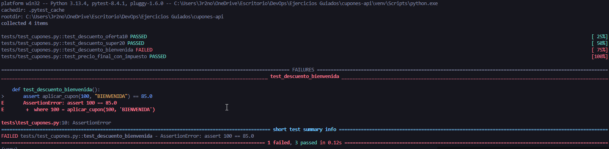
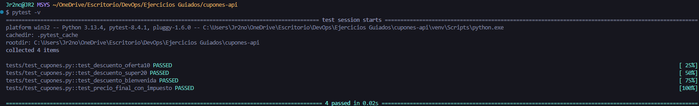

# Pruebas de Regresión Automatizadas en una API de Cupones

## Grupo 6

### Preguntas finales

1. ¿Por qué fue difícil detectar la regresión sin pruebas?

2. ¿Cómo te ayuda el testing automatizado a mantener calidad?

3. ¿Qué otras partes del código deberías cubrir con pruebas?

4. ¿Cómo evitarías errores similares en el futuro?

### Capturas de pantalla

- Test Failed

- Test Passed

5.  Resumen de cómo se detecto la regresión y cómo se evitarán en el futuro.